# Peregrinus draaiboek
## Voor de vlucht
### Rockblock account voor het versturen van berichten
Berichten versturen via het iridium sattelietennetwerk is helaas niet gratis en we moeten betalen voor elke zending. We doen dit op volgende wijze. Een creditcard is nodig voor de betaling.

1. Surf naar de [rockblock website](https://rockblock.rock7.com/). Als je nog geen account hebt, druk dan op **create an account**, en volg de stappen van de website om een account aan te maken.
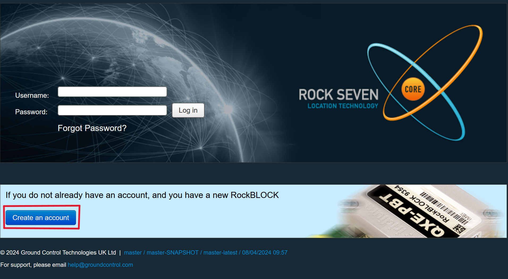
2. Log in op je rockblock-account met je gebruikersnaam en wachtwoord.
3. Klik in het linkermenu op **My ROCKBLOCKS** en voeg de rockblock toe aan je account, door de zes of zeven letters op de modem in te voeren in het vak met de naam **registration code** en klik op **add**.
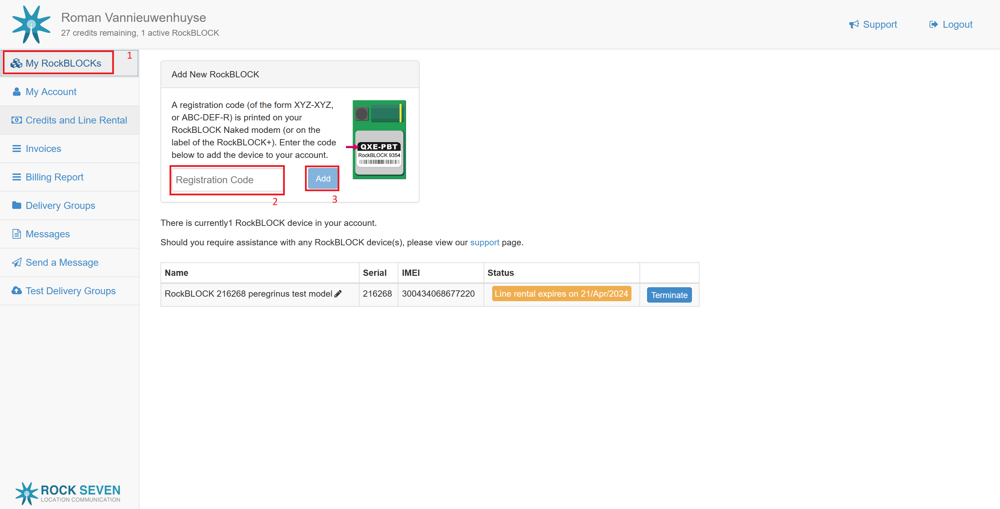
Als je bij deze stap problemen ondervindt, bijvoorbeeld indien de rockblock niet verschijnt bij het toevoegen, is het altijd een goed idee customer service te contacteren via [support@rock7.com](support@rock7.com).
4. Navigeer nu in het menu links naar **Credits and Line Rental** en schaf voldoende credits aan. (Zie volgende paragraaf.) Credits vervallen niet, dus het kan geen kwaad deze op voorhand te kopen.
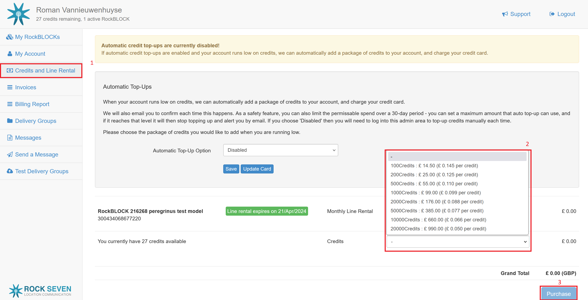
5. Naast credits moet je ook een line rental "huren" voor de maand waarin je berichten wil versturen. Een line rental vervalt na een maand maar moet enkel actief zijn op het moment dat je berichten wil versturen met iridium.
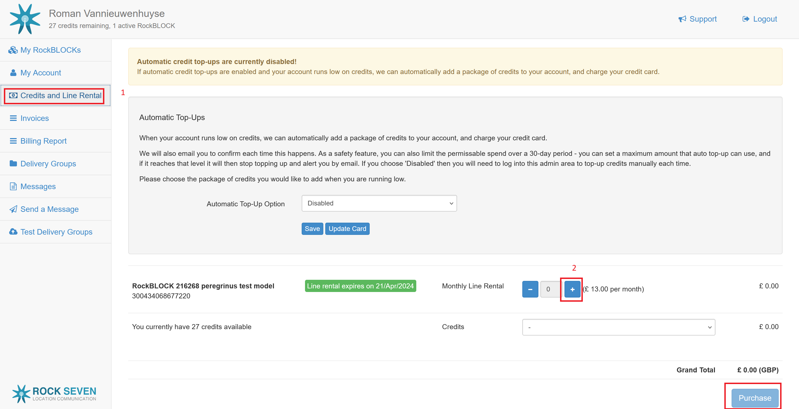

### Benodigde credits
In de eerste fase (5244180 ms) gaan we elke 10000ms een bericht versturen dat 3 credits gebruikt. Voor de eerste fase hebben we dus 1574 credits nodig. Voor de tweede fase is het minder duidelijk hoeveel berichten we gaan kunnen versturen. Die duurt 1441400ms en we gebruiken elke 10000ms 7 credits, wat zou neerkomen op 1008 credits. Omdat we waarschijnlijk wel niet altijd van de eerste keer erin gaan slagen om het bericht te versturen denk ik dat voor de hele missie 2000 credits een goede schatting is.

## De vlucht
Nu de credits aangekocht zijn en de line rental actief is, is het tijd voor de lancering.

Normaal kunnen we tijdens de vlucht al berichten zien binnnenkomen op de [rockblock website](https://rockblock.rock7.com/), klik hiervoor links op **Messages**.
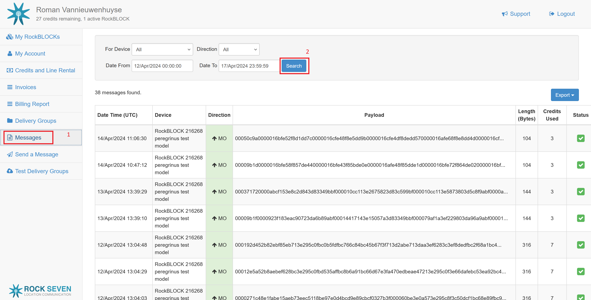

## Na de vlucht
### Rauwe data omzetten in een .csv bestand
We hebben nu een heleboel berichten ontvangen met voor mensen compleet onleesbare data. Download alle berichten van tijdens de vlucht via de [rockblock website](https://rockblock.rock7.com/), klik links op **Messages**, rechts bovenaan klik je op de blauwe knop **Export** en je kiest voor **CSV**. 
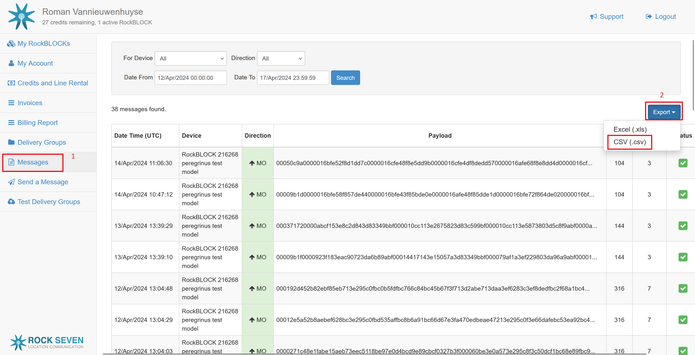
Nu is het tijd om op de website waar je dit leest de software te downloaden die de data verwerkt. Hoe dit proces exact verloopt hangt af van je besturingssysteem

- **Windows**
    1. Download het bestand [cstb.exe](https://github.com/RomanVannieuwenhuyse/peregrinus-data-processing/releases/download/v0.0-alpha/cstb.exe).
    2. Zet het in een folder, samen met de gedownloade messages van hierboven.
    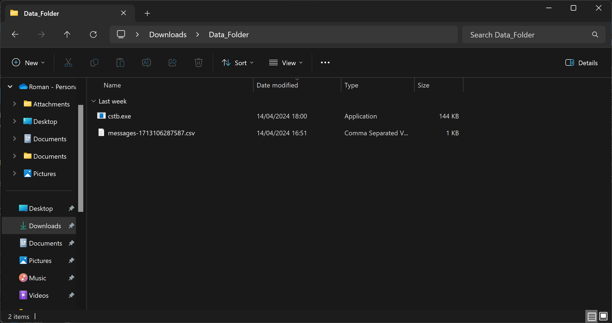
    3. Klik met de rechtermuisknop in de folder en klik op **Open in terminal**
    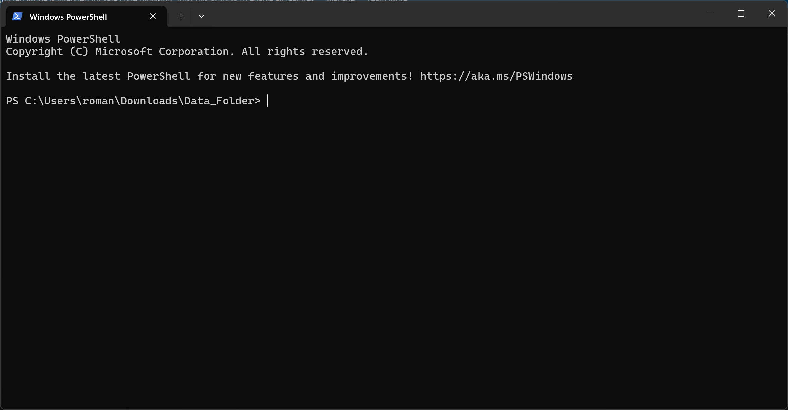
    4. Typ in het terminalvenster dat nu verschijnt volgend commando en voer het uit door op **enter** te drukken. (vervang *messages-1234567890123.csv* door de naam van  het messages bestand dat je daarnet hebt gedownload van de rockblock website)
        ```
        .\cstb.exe .\messages-1234567890123.csv
        ```
    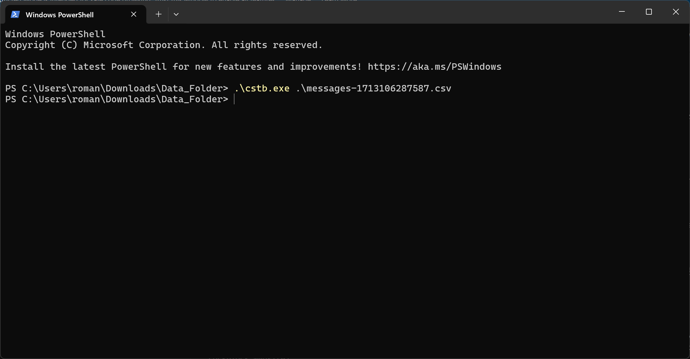
    5. Nu zouden er in de folder twee nieuwe bestanden moeten verschijnen: *phase_one_data.csv* en *phase_two_data.csv*
    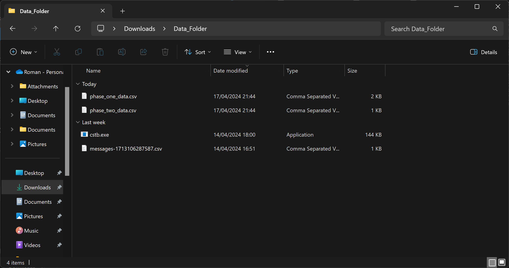
- **Mac of Linux**
    Download de code, compileer het bestand en volg met dat bestand stappen 2-5 uit het bovenstaande. Let op! het commando dat je zal moeten gebruiken zal er waarschijnlijk eerder als volgt uitzien, maar dit verschilt per besturingssysteem.
    ```
    ./cstb messages-1234567890123.csv
    ```

### CSV bestand importeren in Google Sheets
Hieronder volgt een stap voor stap uitleg voor het importeren van de data in Google sheets. De eenheden van de data zijn als volgt:
|timestamp|counts|temp|mag|gyro|accel|
|ms sinds opstart peregrinus|aantal counts van de stralingsdetector, in fase 1: de voorbije 1000ms, in fase 2: de voorbije 435ms|graden celsius|gauss|graden per seconde|g, de valversnelling|

1. Open een leeg Google spreadsheets. Klik op **Bestand > Importeren > Uploaden** en importeer *phase_one_data.csv*.
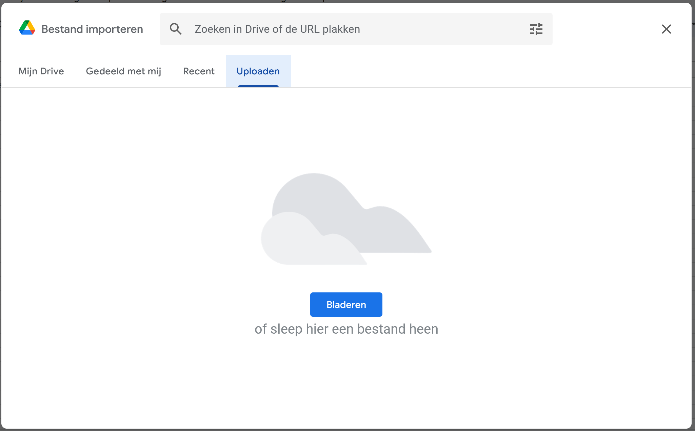
2. Zorg ervoor dat "Tekst naar getallen, datums en formules converten" afgevinkt staat en klik op **gegevens importeren**. 
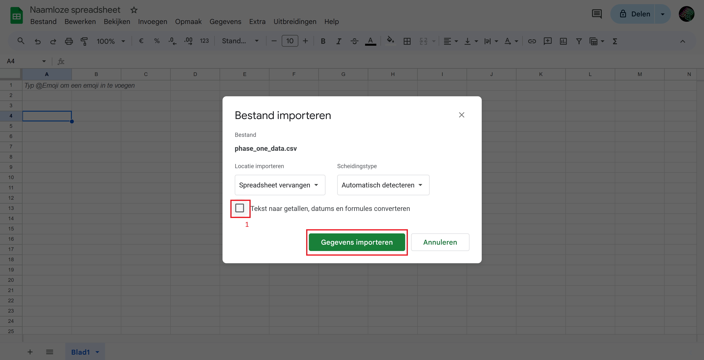
3. Druk op **ctrl+f**, en klik in het vakje dat verschijnt op de drie verticale puntjes.
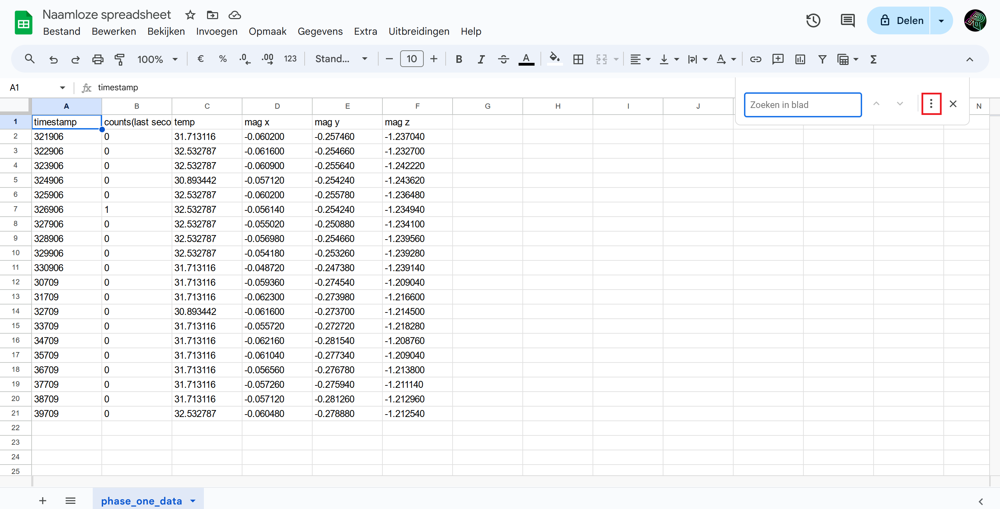
4. Voer nu bij het vak **Zoeken** een punt in en bij het vak **Vervangen door** een komma en druk op **Alles vervangen** en daarna op **Klaar**.
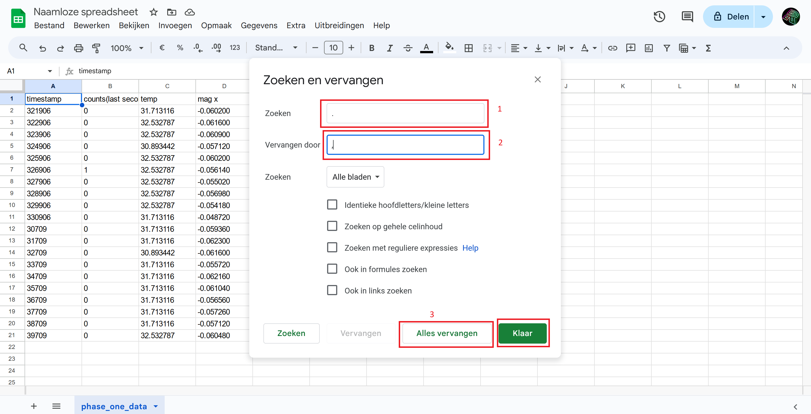
5. Selecteer de timestamp en count data, klik in de werkbalk op **123 > Aangepaste getalnotatie**.
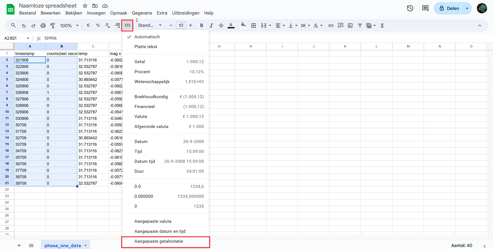
6. Er verschijnt nu een scherm. Voer in het invoervak ```0``` in en klik op **Toepassen**.
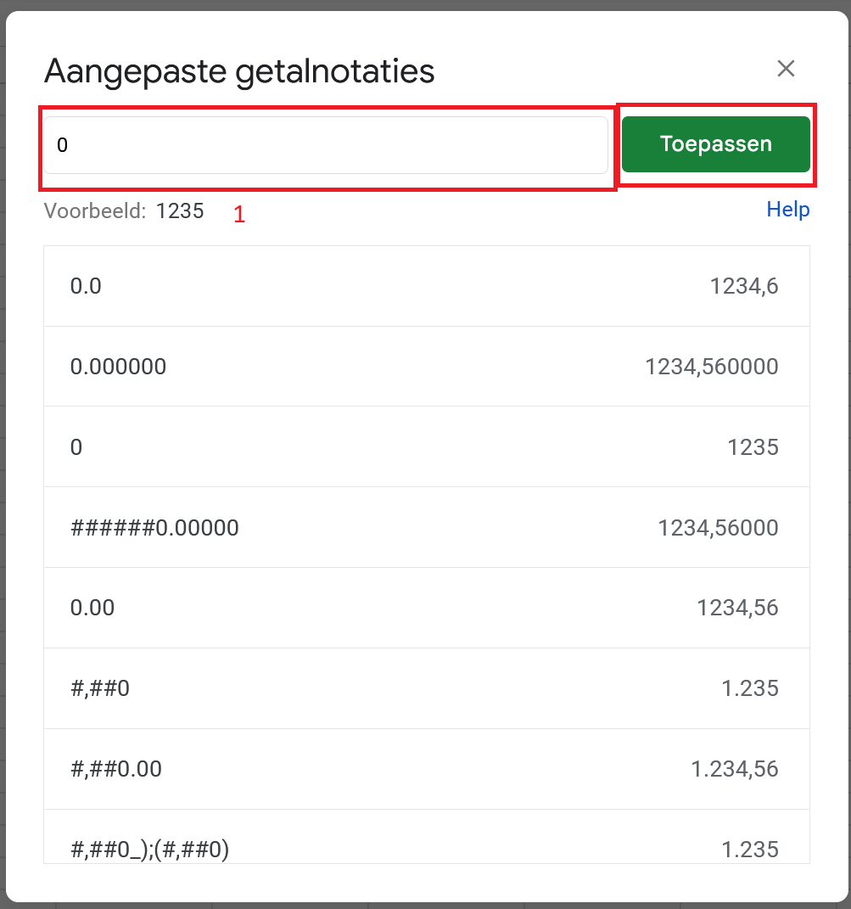
7. Selecteer nu de temperatuur en magnetometer data, en klik opnieuw op **123 > Aangepaste getalnotatie** en voer nu in het invoervak ```0.000000``` in en klik op **Toepassen**.
8. Selecteer nu alle data, klik met de rechtermuisknop en navigeer naar **Meer celacties bekijken > conditionele opmaak**.
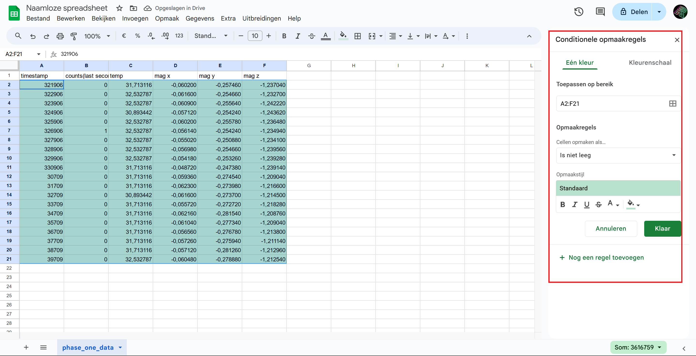
9. Selecteer in het dropdownmenu onder **Opmaakregels** de onderste optie, **Aangepaste formule is**.
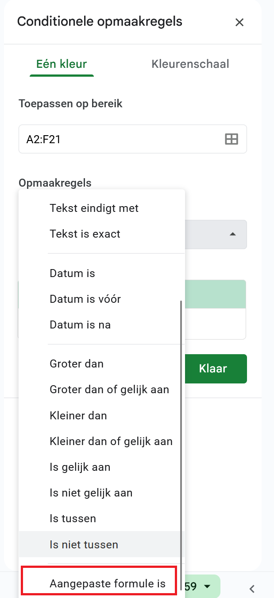
10. Voer in het verschenen invoervak het volgende in en klik op **klaar**.
    ```
    =LT(REST(RIJ()-2;20);10)
    ```
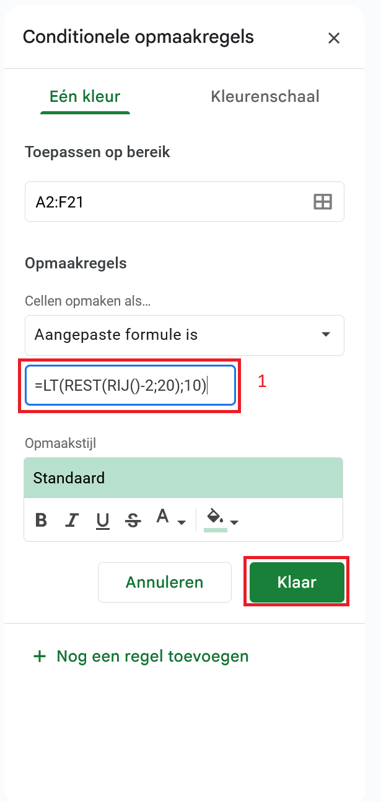

11. Herhaal stap 1 en 2, maar importeer de data naar een nieuw blad door onder **Locatie importen** nu **Nieuwe bladen importeren** te selecteren.
12. Herhaal stap 3 en 4 in dit nieuwe blad.
13. Herhaal stap 5 en 6, maar deze keer enkel voor de timestamp data.
14. Herhaal stap 7, maar deze keer voor de temperatuur, gyro en acceleratie data.
15. Herhaal stappen 8, 9 en 10, in het nieuwe blad, maar voer deze keer het volgende in:
```
=LT(REST(RIJ()-2;46);23)
```

### Data verder verwerken
Nu is de data beschikbaar voor verdere analyse.